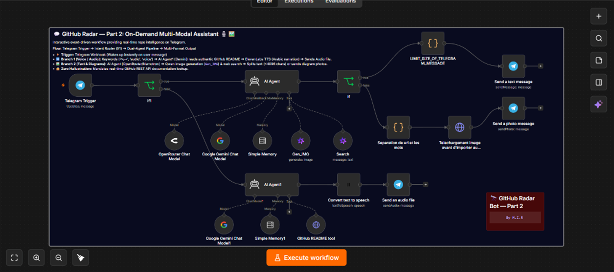

# 🔭 GitHub Radar — Part 2: Interactive On-Demand Assistant 💬🎙️

[](https://n8n.io/)
[](https://telegram.org/)
[](https://langchain.com/)
[](https://elevenlabs.io/)
[](https://docs.github.com/en/rest)
[](README.md)
[](LICENSE)

> 💬 **An interactive, event-driven Telegram AI assistant that answers on-demand questions about any GitHub repository. It reads the authentic README via the GitHub REST API and delivers natural Arabic voice podcasts (ElevenLabs), in-depth text analysis, and illustrative diagrams (Qwen Image Gen) — with zero hallucination.**

> 🌍 **Language Scope (نطاق اللغة):**  
> This system is engineered and optimized **exclusively for the Arabic language** (يدعم اللغة العربية فقط). All user interactions, AI reasoning prompts, audio voice podcasts (ElevenLabs), and technical diagrams are generated strictly in Arabic.

👨‍💻 **Built with ❤️ by M.I.R.**

---

## 📸 Workflow Architecture

### 🛠️ Complete n8n Automated Pipeline (Part 2)
Event-driven Telegram trigger, intelligent intent routing (`If1`), dual-agent reasoning pipeline (OpenRouter/Nemotron + Gemini), authentic GitHub README tool, ElevenLabs voice narration, Alibaba Cloud Qwen image generation, and Telegram media delivery:

<p align="center">
  <a href="assets/n8n_part2_workflow_canvas.png">
    
  </a>
</p>

---

## 🧭 The Two-Part Ecosystem & Architectural Separation

This repository is **Part 2** of the **GitHub Radar** system. The complete architecture is intentionally decoupled into two complementary modules:

| Module | Primary Trigger | Core Role | Repository Link |
| :--- | :--- | :--- | :--- |
| **Part 1** | `Schedule Trigger` (Cron) | **Autonomous Daily Digest:** Runs automatically on schedule, scans trending repos (50K+ stars), reads real documentation, and broadcasts curated briefs. | [github-repositories-radar-PT1 (Part 1)](https://github.com/Ilyeess-Rj/github-repositories-radar-PT1) |
| **Part 2 (This Repository)** | `Telegram Trigger` (Webhook) | **Interactive On-Demand Assistant:** Answers real-time user questions about any repository with Arabic voice narration (ElevenLabs), text analysis, and diagrams. | [github-repositories-radar_PT2 (Part 2)](https://github.com/Ilyeess-Rj/github-repositories-radar_PT2) |

### ⚠️ Why are Part 1 & Part 2 Split into Separate Workflows?
> **Key n8n Architectural Constraint:**  
> In n8n, a single workflow **cannot support two active, independent trigger nodes** simultaneously without causing execution conflicts, event listener collisions, and webhook routing issues.
> 
> * **Part 1** must be driven by a **Schedule Trigger** (runs periodically on a clock).
> * **Part 2** must be driven by an event-based **Telegram Trigger** (wakes up when a user sends a chat message).
>
> Because n8n requires each automated flow to possess an unambiguous lifecycle entry point, we cleanly decoupled the radar into **two modular workflows**. You import and run each workflow independently in your n8n instance for maximum stability and zero trigger interference.

---

## 🎯 What Part 2 Does

### 🎙️ 1. Spoken Arabic Voice Explanation (Podcast Mode)
- Mention keywords like `صوت`, `تسجيل`, `audio`, or `voice` in your message.
- The agent calls the GitHub API to fetch the real README, crafts an engaging narrative summary in Modern Standard Arabic, converts it into ultra-realistic voice audio via **ElevenLabs**, and delivers an audio file straight to your Telegram chat.

### 📝 2. In-Depth Text & Architectural Diagrams (Visual Mode)
- Ask regular technical questions or explore integration possibilities.
- The agent analyzes the project, suggests actionable *"Ideas to Stand Out"* (side projects, RAG integrations, free tool substitutions), and can generate architectural diagrams via **Alibaba Cloud / Qwen (`Gen_IMG`)**.

### 🔒 3. Fully Grounded (Zero Hallucination)
- The agent is strictly forbidden from answering from pre-trained memory. It must query the `GitHub README tool` first for verified facts.

---

## 🧩 Tech Stack

| Service | Role |
| :--- | :--- |
| **n8n** | Event-driven workflow orchestration engine |
| **Telegram Bot API** | Interactive mobile interface for on-demand queries |
| **OpenRouter (Nemotron)** + **Google Gemini** | Dual LLMs powering reasoning, routing, and synthesis |
| **Qwen (Alibaba Cloud)** | Search tool + on-demand diagram/image generation |
| **ElevenLabs** | Natural Text-to-Speech synthesis in Arabic |
| **GitHub REST API** | Fetches live repository README documentation |

---

## ⚙️ Setup & Usage

### 1. Import Workflow
- In n8n: **Workflows → Import from File** → select `GITHUB_RADAR_PT2_clean.json`.

### 2. Connect Credentials
Attach your API credentials to the designated nodes:

| Credential | Node | Where to get it |
| :--- | :--- | :--- |
| **Telegram API** | Telegram Trigger & Send Nodes | [@BotFather](https://t.me/BotFather) |
| **OpenRouter API** | OpenRouter Chat Model | [openrouter.ai](https://openrouter.ai) |
| **Google Gemini (PaLM) API** | Google Gemini Chat Model | [Google AI Studio](https://aistudio.google.com) |
| **Alibaba Cloud API** | Search & Gen_IMG Tools | [Alibaba Cloud Model Studio](https://www.alibabacloud.com) |
| **ElevenLabs API** | Convert text to speech | [elevenlabs.io](https://elevenlabs.io) |

### 3. Dynamic Chat ID
The Telegram output nodes are already configured dynamically:
`chatId: "={{ $('Telegram Trigger').item.json.message.chat.id }}"`  
The bot automatically replies directly to whoever messages it.

### 4. Activate Workflow
Toggle the workflow to **Active**. You can now message your Telegram bot anytime!

---

## 🗂️ Project Structure

```text
github-repositories-radar/
├── assets/
│   └── n8n_part2_workflow_canvas.png # Screenshot of the n8n Part 2 workflow canvas
├── GITHUB_RADAR_PT2_clean.json       # Sanitized n8n workflow for Part 2
├── .env.example                     # Credentials template
├── .gitignore                       # Leak protection
├── LICENSE                          # Apache 2.0 license
└── README.md                        # Documentation & architectural guide
```

---

## 📜 License

This project is licensed under the **Apache License 2.0**.  
See the [LICENSE](LICENSE) file for full legal terms.

---

<p align="center">
  <b>Built by M.I.R</b> — Autonomous AI solutions for developers and tech enthusiasts.
</p>
